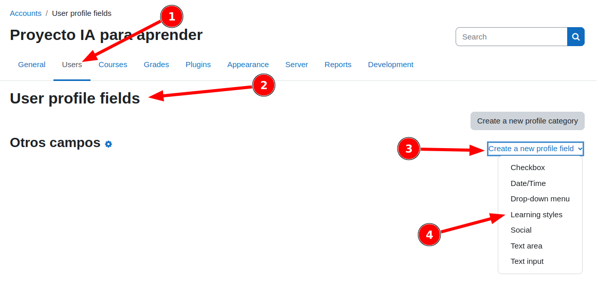
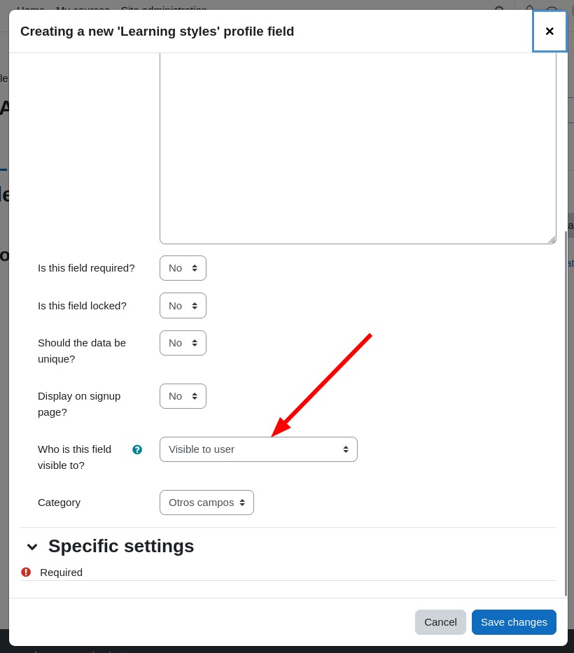

# Configure the component #

To use the component, you need to add the field to the user's profile, in:
```
Users / User Profile Fields
```



A **“Learning Styles”** type field is added and configured taking care that the user can view it.



**Note:** the field can be added several times but the results will always be associated directly to the user, not for each instance of the field, so it does not make sense to do it more than once.
