# Learning styles #

## User profile ##

Access to options related to the analysis of learning styles are found in the user's profile. To do this, in the user menu select the “Profile” option.

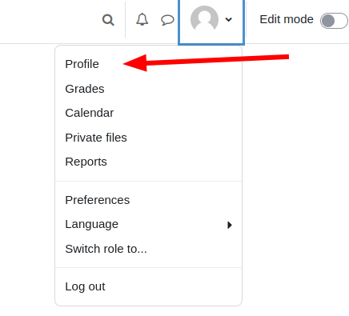

## Profile settings ##

The first time the user's profile must be edited so that the survey can be accessed. Profile editing can be activated from the profile page or in the path:
```
Preferences / User Account / Edit Profile
```

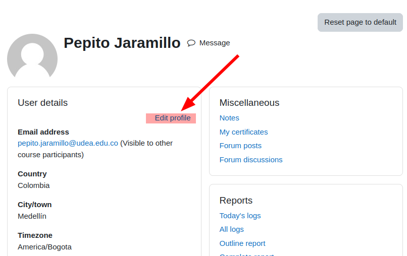

When editing, the profile information is separated by sections, the custom user fields are found at the end in a section defined on each platform, in the case of the example it is called “Other fields”.

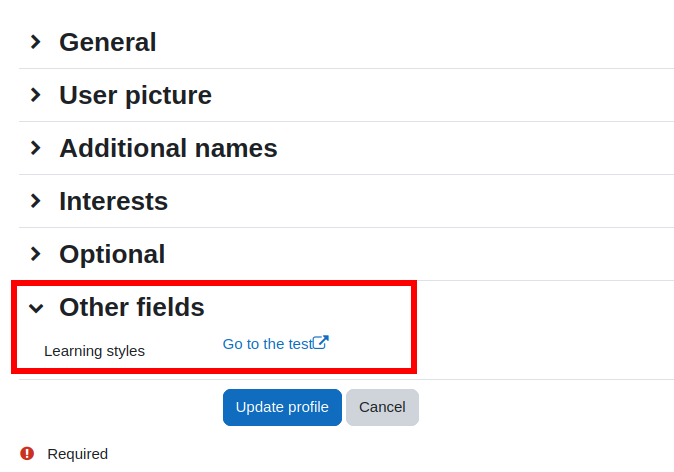


In this section you will find the field with a link “Go to the test” that allows you to view the page where it is carried out.

**Note:** The user profile field must have been previously added to the platform as it is a dynamic field that must be configured in the site administration.

## Take the test ##

Following the link *Go to the test*, a new window is displayed in which the instructions are shown that must be read carefully since important observations are made there to carry out the survey.

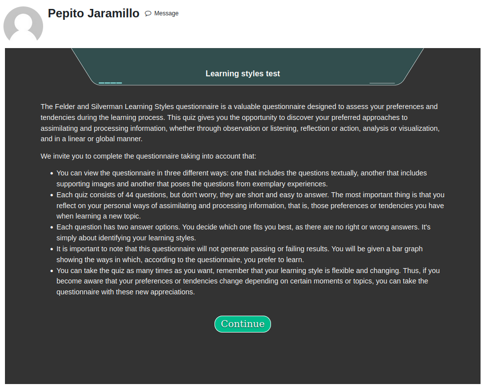


When starting, the user can choose between 3 ways to view the survey:

1. **Direct questions:** this is the original survey proposed by Felder and Silverman.
2. **Direct questions with images:** it is an adaptation of the original where images are added to support people with more visual learning styles.
3. **Experiential questions:** it is an adaptation that gives an interpretation to the original questions, focusing each of them on a specific case that the person can judge according to their experience.

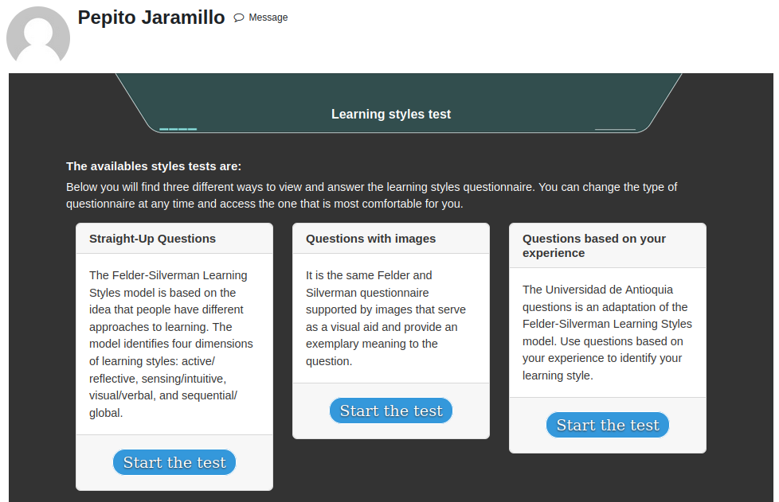

#### It is important to note that at any time during the test the user can change between the three forms of the survey as it is most clear for their case. ####

### Direct questions ###

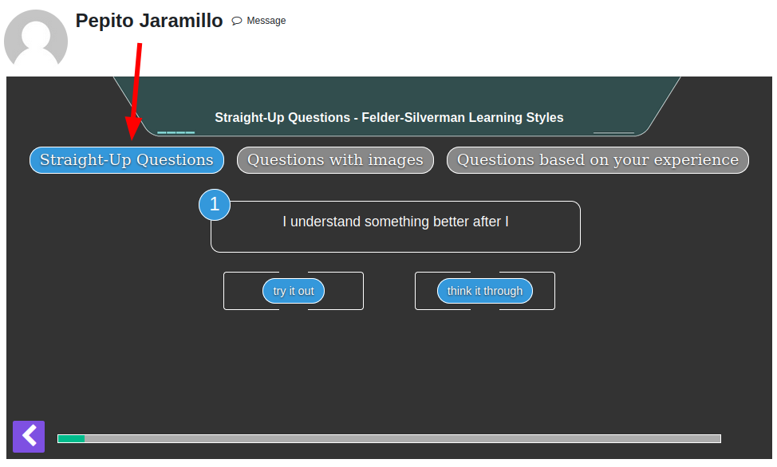

### Direct questions with images ###

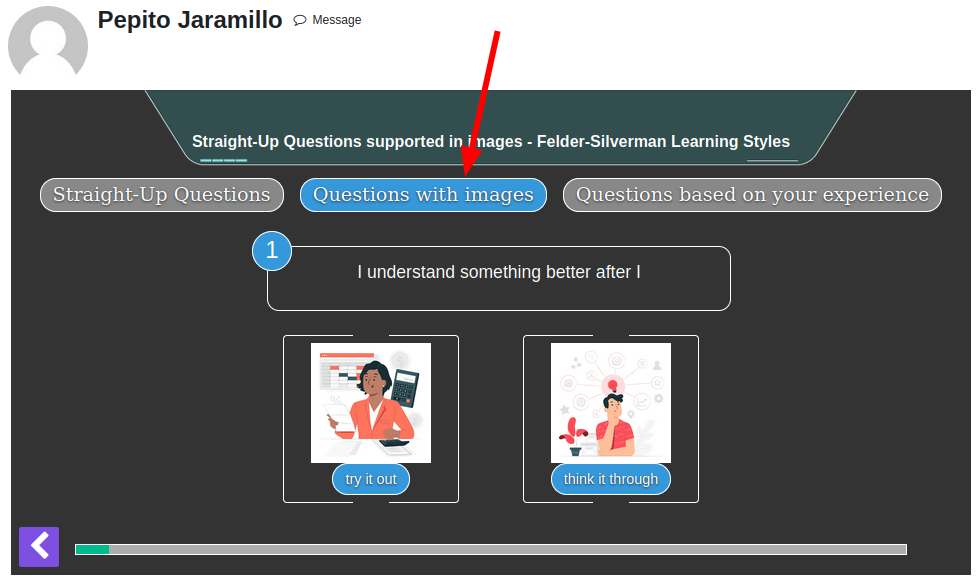

### Experiential questions ###

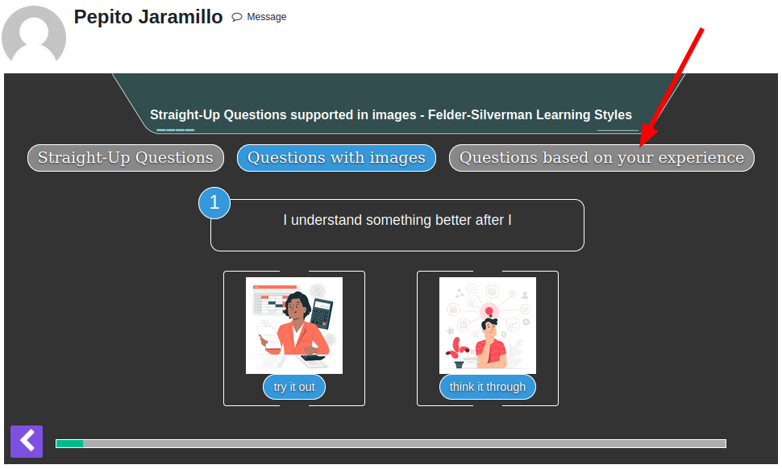

**Note:** the information is only saved if the survey is completed, at which time a message is displayed indicating that the registration has been successful.

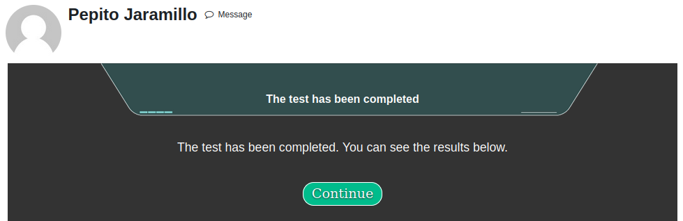

After saving the answers you can see a graph with the result.

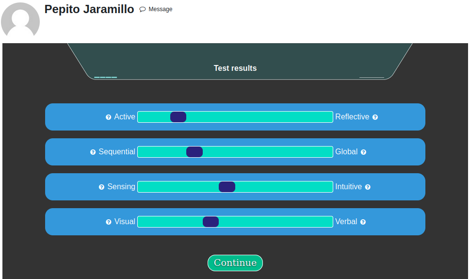

After the graph, you have the possibility of seeing an analysis with the information of each personalized style according to the value of the survey result.

The colors of the result in the analysis will depend on the user's affinity with each learning style (how far to the left or right the membership is in that dimension), like this:
- **Golden:** very balanced, the result is close to the center.
- **Green:** affinity is intermediate.
- **Salmon:** There is a lot of affinity and the value is very much at the extreme of that style in the corresponding dimension.

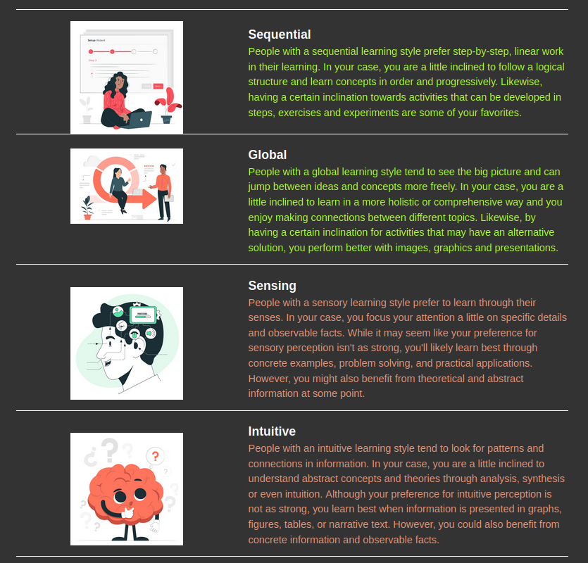


The results are always found on the profile page, and you also have the option to take the survey again whenever you want, however, each new test overwrites the previous ones since it is considered that the style can change over time:

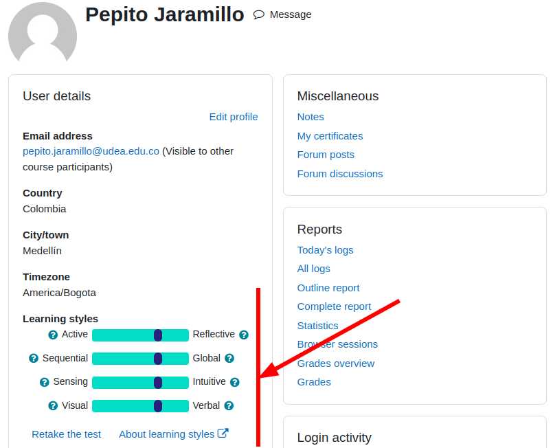
