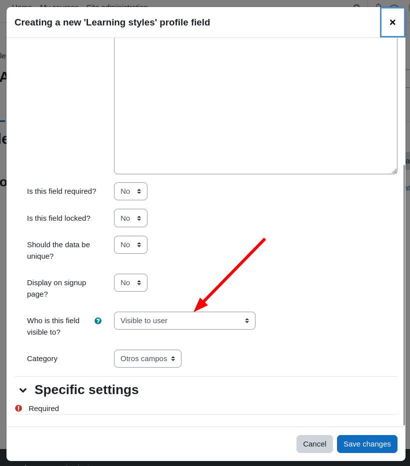

# Configurar el componente #

Para utilizar el componente se requiere agregar el campo en el perfil del usuario, en:

```
Usuarios / Campos del perfil del usuario
```


Se agrega un campo de tipo **“Estilos de aprendizaje”** y se configura teniendo cuidado que el usuario pueda visualizarlo.



**Nota:** se puede agregar varias veces el campo pero los resultados siempre estarán asociados directamente al usuario, no por cada instancia del campo, por lo que no tiene sentido hacerlo más de una vez.
