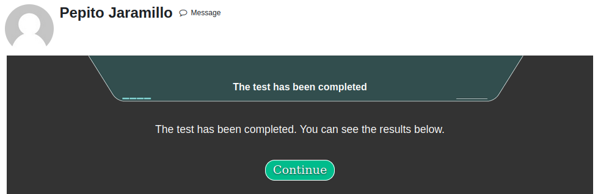

# Estilos de aprendizaje #

## Perfil del usuario ##

El acceso a las opciones relacionadas con el análisis de los estilos de aprendizaje se encuentran en el perfil del usuario. Para ello, en el menú del usuario seleccionar la opción “Perfil”.


## Configuración del perfil ##

La primera vez se debe editar el perfil del usuario para que se pueda acceder a la encuesta. La edición del perfil se puede activar desde la página de perfil o también se puede por la ruta:
```
Preferencias / cuenta de usuario / Editar perfil
```


Al editar, la información del perfil se encuentra separada por secciones, los campos personalizados de usuario se encuentran al final en una sección definida en cada plataforma, en el caso del ejemplo tiene el nombre “Otros campos”.


En esta sección se encuentra el campo con un enlace “Ir a la prueba” que permite visualizar la página donde se lleva a cabo.

**Nota:** el campo de perfil de usuario debe haberse agregado previamente a la plataforma ya que es un campo dinámico que se debe configurar en la administración del sitio.

## Realizar la prueba ##

Siguiendo el enlace *Ir a la prueba* se despliega una ventana nueva en la cual se muestran las instrucciones que deben ser leídas con detenimiento puesto que allí se hacen observaciones importantes para realizar la encuesta.


Al iniciar el usuario podrá elegir entre 3 formas de visualizar la encuesta:

1. **Preguntas directas:** es la encuesta original propuesta por Felder y Silverman.
2. **Preguntas directas con imágenes:** es una adaptación de la original donde se adicionan imágenes para apoyar a las personas con estilos de aprendizaje más visuales.
3. **Preguntas experienciales:** es una adaptación que da una interpretación a las preguntas originales enfocando cada una de ellas a un caso específico que la persona puede juzgar según su experiencia.


#### Es importante anotar que en cualquier momento de la prueba el usuario puede cambiar entre las tres formas de la encuesta según le resulte de mayor claridad para su caso. ####

### Preguntas directas ###


###  Preguntas directas con imágenes ###


### Preguntas experienciales ###


**Nota:** solamente se guarda la información si se completa la encuesta, en ese momento se muestra un mensaje que indica que el registro ha sido exitoso.



Después de guardar las respuestas se puede ver un gráfico con el resultado.


Posterior al gráfico se tiene la posibilidad de ver un análisis con la información de cada estilo personalizado según el valor del resultado de la encuesta.

Los colores del resultado en el análisis van a depender de la afinidad del usuario con cada estilo de aprendizaje (qué tan a la izquierda o derecha está la pertenencia en esa dimensión), así:

- **Dorado:** muy balanceado, el resultado se acerca al centro.
- **Verde:** la afinidad es intermedia.
- **Salmon:** hay mucha afinidad y el valor se encuentra muy en el extremo de ese estilo en la dimensión correspondiente.


En la página del perfil siempre se encuentran los resultados, además se tiene la opción para realizar nuevamente la encuesta cuando se desee, sin embargo, cada nueva prueba sobrescribe las anteriores ya que se considera que el estilo puede cambiar en el tiempo:


